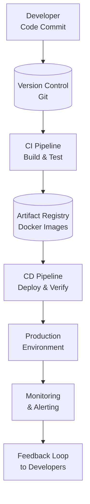

# CI/CD Pipelines

## Summary
CI/CD (Continuous Integration/Continuous Deployment) pipelines automate the software delivery process, enabling rapid, reliable, and frequent code deployments through automated building, testing, and deployment stages.

## Problem Statement
Traditional software delivery involves manual processes that are slow, error-prone, and create bottlenecks between development and operations teams. CI/CD addresses these challenges by automating the entire software delivery lifecycle, reducing deployment time from days/weeks to minutes while improving quality and reliability.

## Key Concepts & Architecture

### Core Components
- **Version Control:** Git repositories as the source of truth for code changes
- **Build System:** Compiles source code into deployable artifacts
- **Test Automation:** Automated unit, integration, and end-to-end tests
- **Artifact Repository:** Stores build artifacts and dependencies
- **Deployment Automation:** Automated deployment to various environments
- **Monitoring & Feedback:** Tracks deployment success and application health

### Architecture Overview


## Configuration & Setup

### Prerequisites
- Git repository (GitHub, GitLab, Bitbucket)
- CI/CD platform (GitHub Actions, GitLab CI, Jenkins, Azure DevOps)
- Cloud provider or self-hosted infrastructure
- Container registry (Docker Hub, ECR, GCR)

### GitHub Actions Example
```yaml
# .github/workflows/ci-cd.yml
name: CI/CD Pipeline
on:
  push:
    branches: [ main, develop ]
  pull_request:
    branches: [ main ]

jobs:
  build-and-test:
    runs-on: ubuntu-latest
    steps:
      - uses: actions/checkout@v4

      - name: Setup Node.js
        uses: actions/setup-node@v4
        with:
          node-version: '18'
          cache: 'npm'

      - name: Install dependencies
        run: npm ci

      - name: Run tests
        run: npm test

      - name: Build application
        run: npm run build

      - name: Build Docker image
        run: docker build -t myapp:${{ github.sha }} .

      - name: Push to registry
        run: |
          docker tag myapp:${{ github.sha }} myregistry/myapp:latest
          docker push myregistry/myapp:latest
```

### GitLab CI Example
```yaml
# .gitlab-ci.yml
stages:
  - build
  - test
  - deploy

variables:
  DOCKER_DRIVER: overlay2

build:
  stage: build
  image: docker:latest
  services:
    - docker:dind
  script:
    - docker build -t myapp:$CI_COMMIT_SHA .
    - docker push myregistry/myapp:$CI_COMMIT_SHA

test:
  stage: test
  image: node:18
  script:
    - npm install
    - npm test

deploy:
  stage: deploy
  image: kubectl:latest
  script:
    - kubectl apply -f k8s/
  only:
    - main
```

## Usage Examples

### Common Workflows

1. **Feature Branch Workflow:** Developers create feature branches, CI runs tests on pull requests, CD deploys to staging after merge to main
2. **Trunk-based Development:** All developers commit to main branch, CI ensures quality, CD handles progressive deployment
3. **GitOps Workflow:** Infrastructure and application code stored in Git, CI/CD applies changes automatically

### Code Examples

#### Node.js Application with Docker
```dockerfile
# Dockerfile
FROM node:18-alpine AS builder
WORKDIR /app
COPY package*.json ./
RUN npm ci --only=production

FROM node:18-alpine AS runtime
WORKDIR /app
COPY --from=builder /app/node_modules ./node_modules
COPY . .
USER node
EXPOSE 3000
CMD ["node", "server.js"]
```

#### Express.js Server
```javascript
// server.js
const express = require('express');
const app = express();
const port = process.env.PORT || 3000;

app.get('/health', (req, res) => {
  res.json({ status: 'OK', timestamp: new Date().toISOString() });
});

app.get('/api/data', (req, res) => {
  res.json({ message: 'Hello from CI/CD pipeline!' });
});

app.listen(port, () => {
  console.log(`Server running on port ${port}`);
});
```

## Best Practices & Guidelines

### Recommended Patterns
- **Pipeline as Code:** Store all pipeline configuration in version control
- **Immutable Artifacts:** Each build produces unique, immutable artifacts
- **Environment Parity:** Keep development, staging, and production environments similar
- **Database Migrations:** Include schema changes in deployment pipeline
- **Feature Flags:** Use feature toggles for safer deployments

### Security Considerations
- **Secret Management:** Use tools like HashiCorp Vault, AWS Secrets Manager, or GitHub Secrets
- **Vulnerability Scanning:** Integrate security scanning in CI pipeline
- **Access Controls:** Limit who can deploy to production environments
- **Compliance:** Implement audit trails for deployments

```yaml
# Security scanning example
- name: Security Scan
  uses: securecodewarrior/github-action-sast-scan@v1
  with:
    api-key: ${{ secrets.SCW_API_KEY }}

- name: Dependency Check
  run: npm audit --audit-level=moderate
```

### Performance Optimization
- **Parallel Execution:** Run independent stages in parallel
- **Caching:** Cache dependencies and build artifacts
- **Selective Testing:** Run only relevant tests for changed code
- **Artifact Optimization:** Compress and optimize build artifacts

## Troubleshooting & Common Issues

### Common Problems

| Issue | Symptom | Solution |
|-------|---------|----------|
| **Pipeline Failures** | Tests failing intermittently | Implement retry logic and better test isolation |
| **Slow Builds** | Long build times | Use caching and parallel execution |
| **Deployment Rollbacks** | Production issues after deployment | Implement automated rollback and health checks |
| **Secret Leaks** | Sensitive data in logs | Use secret masking and proper access controls |

### Debugging Commands
```bash
# View pipeline logs
gh run list
gh run view <run-id>

# Check deployment status
kubectl rollout status deployment/myapp

# View application logs
kubectl logs -f deployment/myapp

# Debug failing tests
npm test -- --verbose --coverage
```

## Integration & Ecosystem

### Related Tools
- **GitHub Actions:** Native GitHub integration with marketplace actions
- **GitLab CI:** Integrated with GitLab's DevOps platform
- **Jenkins:** Highly customizable with extensive plugin ecosystem
- **Azure DevOps:** Microsoft's comprehensive DevOps solution

### CI/CD Integration Examples

#### With Docker Compose
```yaml
# docker-compose.yml
version: '3.8'
services:
  web:
    build: .
    ports:
      - "3000:3000"
    environment:
      - NODE_ENV=production
    depends_on:
      - db

  db:
    image: postgres:15
    environment:
      - POSTGRES_PASSWORD=secret
```

#### With Kubernetes
```yaml
# k8s/deployment.yml
apiVersion: apps/v1
kind: Deployment
metadata:
  name: myapp
spec:
  replicas: 3
  selector:
    matchLabels:
      app: myapp
  template:
    metadata:
      labels:
        app: myapp
    spec:
      containers:
      - name: myapp
        image: myregistry/myapp:latest
        ports:
        - containerPort: 3000
        livenessProbe:
          httpGet:
            path: /health
            port: 3000
```

## Trade-offs & Alternatives

### Alternative Approaches
- **Manual Deployments:** Human-driven process with change management
  - **Pros:** Full control, thorough review process
  - **Cons:** Slow, error-prone, inconsistent
  - **When to use:** Highly regulated industries, small teams

- **Platform-specific Solutions:** Heroku, Vercel, Netlify automated deployments
  - **Pros:** Simplicity, managed infrastructure
  - **Cons:** Vendor lock-in, limited customization
  - **When to use:** Small projects, specific platform requirements

### Decision Framework
- **Choose CI/CD when:** Frequent releases needed, team size > 5, quality assurance critical
- **Consider alternatives when:** Simple static sites, highly regulated environments, very small teams

## Monitoring & Observability

### Key Metrics
- **Pipeline Success Rate:** Percentage of successful builds/deployments
- **Build Duration:** Time from commit to deployment
- **Deployment Frequency:** How often deployments occur
- **Mean Time to Recovery:** Time to fix deployment issues

### Alerting Setup
- **Pipeline Failures:** Alert on consecutive failures
- **Performance Degradation:** Monitor build/deployment times
- **Security Issues:** Alert on vulnerability findings

## Advanced Topics

### Deep Dive Sections

#### Blue-Green Deployments
```yaml
# Blue-green deployment strategy
- name: Blue-Green Deploy
  run: |
    # Deploy to green environment
    kubectl apply -f k8s/green/
    # Validate green environment
    ./scripts/validate-deployment.sh green
    # Switch traffic to green
    kubectl apply -f k8s/traffic-switch/
```

#### Canary Releases
```yaml
# Canary deployment with Istio
- name: Canary Deploy
  run: |
    # Deploy canary version
    kubectl set image deployment/myapp myapp=myapp:canary
    # Gradually increase traffic
    kubectl apply -f istio/canary-10-percent.yml
```

#### Multi-Environment Promotion
```yaml
# Environment promotion pipeline
stages:
  - build
  - test
  - deploy:staging
  - validate:staging
  - deploy:production
```

## Examples / snippets

### Real-world Examples
- **Netflix:** Deploys multiple times per day using Spinnaker
- **Amazon:** Uses continuous deployment for most services
- **Etsy:** Deploys 25-50 times per day with extensive testing

### Configuration Snippets

#### Advanced GitHub Actions
```yaml
name: Advanced CI/CD
on:
  push:
    paths-ignore:
      - 'docs/**'
      - '*.md'

jobs:
  quality:
    runs-on: ubuntu-latest
    steps:
      - uses: actions/checkout@v4
        with:
          fetch-depth: 0

      - name: Run ESLint
        run: npm run lint

      - name: Run tests with coverage
        run: npm test -- --coverage --watchAll=false

      - name: Upload coverage to Codecov
        uses: codecov/codecov-action@v3
```

#### Jenkins Pipeline (Groovy)
```groovy
pipeline {
    agent any

    stages {
        stage('Build') {
            steps {
                sh 'npm install'
            }
        }

        stage('Test') {
            steps {
                sh 'npm test'
            }
            post {
                always {
                    junit 'test-results/*.xml'
                }
            }
        }

        stage('Deploy') {
            when {
                branch 'main'
            }
            steps {
                sh 'kubectl apply -f k8s/'
            }
        }
    }

    post {
        always {
            notifyBuild(currentBuild.result)
        }
    }
}
```

## Links
- [GitHub Actions Documentation](https://docs.github.com/en/actions)
- [GitLab CI/CD Documentation](https://docs.gitlab.com/ee/ci/)
- [Jenkins Documentation](https://www.jenkins.io/doc/)
- [Continuous Integration vs Continuous Delivery vs Continuous Deployment](https://www.atlassian.com/continuous-delivery/principles/continuous-integration-vs-delivery-vs-deployment)
- [12-Factor App Principles](https://12factor.net/)
- [State of DevOps Report](https://cloud.google.com/devops/state-of-devops)
