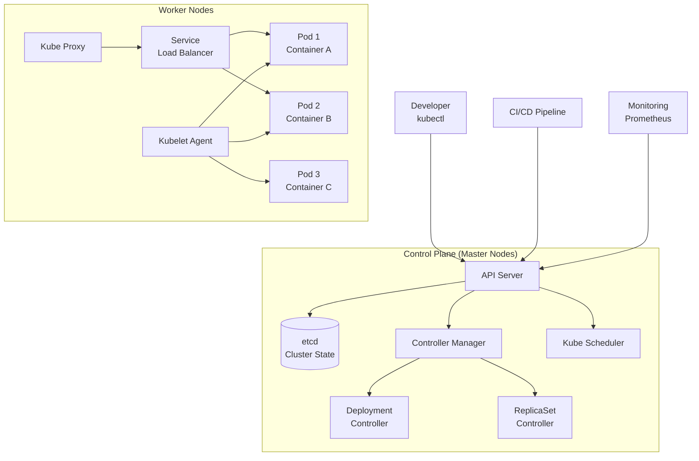

# Kubernetes Orchestration

## Summary
Kubernetes (K8s) is an open-source container orchestration platform that automates deployment, scaling, and management of containerized applications, enabling reliable operation of distributed systems at scale.

## Problem Statement
Managing containers at scale presents significant challenges: ensuring high availability, handling failures gracefully, scaling applications dynamically, and coordinating deployments across multiple servers. Kubernetes addresses these operational complexities by providing a unified platform for container orchestration.

## Key Concepts & Architecture

### Core Components
- **Master Node:** Control plane managing the cluster state
- **Worker Nodes:** Execute application workloads (pods)
- **Pods:** Smallest deployable units containing one or more containers
- **Deployments:** Manage stateless applications with rolling updates
- **Services:** Provide stable networking and load balancing
- **Ingress:** Manage external access to services
- **ConfigMaps & Secrets:** Configuration and sensitive data management

### Architecture Overview


## Configuration & Setup

### Prerequisites
- Linux servers or cloud instances (GCP, AWS, Azure)
- Docker installed on all nodes
- Network connectivity between nodes
- Minimum 2 CPUs and 2GB RAM per node

### Installation & Configuration

#### Using kubeadm (Self-hosted)
```bash
# Initialize master node
sudo kubeadm init --pod-network-cidr=10.244.0.0/16

# Set up kubectl for non-root user
mkdir -p $HOME/.kube
sudo cp -i /etc/kubernetes/admin.conf $HOME/.kube/config
sudo chown $(id -u):$(id -g) $HOME/.kube/config

# Install pod network (Flannel)
kubectl apply -f https://raw.githubusercontent.com/coreos/flannel/master/Documentation/kube-flannel.yml

# Join worker nodes
sudo kubeadm join <master-ip>:<master-port> --token <token> --discovery-token-ca-cert-hash <hash>
```

#### Using Managed Kubernetes (EKS/GKE/AKS)
```bash
# AWS EKS example
aws eks create-cluster --name my-cluster --role-arn <role-arn> --resources-vpc-config <vpc-config>

# Configure kubectl
aws eks update-kubeconfig --name my-cluster

# Verify cluster
kubectl get nodes
```

### Basic Kubernetes Manifests

#### Deployment
```yaml
# deployment.yml
apiVersion: apps/v1
kind: Deployment
metadata:
  name: myapp
  labels:
    app: myapp
spec:
  replicas: 3
  selector:
    matchLabels:
      app: myapp
  template:
    metadata:
      labels:
        app: myapp
    spec:
      containers:
      - name: myapp
        image: myregistry/myapp:v1.2.3
        ports:
        - containerPort: 3000
        env:
        - name: NODE_ENV
          value: "production"
        - name: DATABASE_URL
          valueFrom:
            secretKeyRef:
              name: db-secret
              key: url
        resources:
          requests:
            memory: "128Mi"
            cpu: "250m"
          limits:
            memory: "256Mi"
            cpu: "500m"
        livenessProbe:
          httpGet:
            path: /health
            port: 3000
          initialDelaySeconds: 30
          periodSeconds: 10
        readinessProbe:
          httpGet:
            path: /ready
            port: 3000
          initialDelaySeconds: 5
          periodSeconds: 5
```

#### Service
```yaml
# service.yml
apiVersion: v1
kind: Service
metadata:
  name: myapp-service
spec:
  selector:
    app: myapp
  ports:
  - name: http
    port: 80
    targetPort: 3000
    protocol: TCP
  type: LoadBalancer
```

#### Ingress
```yaml
# ingress.yml
apiVersion: networking.k8s.io/v1
kind: Ingress
metadata:
  name: myapp-ingress
  annotations:
    kubernetes.io/ingress.class: "nginx"
    cert-manager.io/cluster-issuer: "letsencrypt-prod"
spec:
  tls:
  - hosts:
    - myapp.example.com
    secretName: myapp-tls
  rules:
  - host: myapp.example.com
    http:
      paths:
      - path: /
        pathType: Prefix
        backend:
          service:
            name: myapp-service
            port:
              number: 80
```

## Usage Examples

### Common Workflows

1. **Application Deployment:** Deploy stateless applications with rolling updates
2. **Stateful Applications:** Use StatefulSets for databases with persistent storage
3. **Batch Jobs:** Run one-time or scheduled tasks with CronJobs
4. **Canary Deployments:** Gradually roll out new versions using multiple Deployments

### Code Examples

#### Node.js Application with Health Checks
```javascript
// health-check-app.js
const express = require('express');
const app = express();
const port = process.env.PORT || 3000;

let healthy = true;
let ready = false;

// Simulate startup time
setTimeout(() => {
  ready = true;
  console.log('Application ready');
}, 5000);

app.get('/health', (req, res) => {
  if (healthy) {
    res.status(200).json({ status: 'healthy', timestamp: new Date().toISOString() });
  } else {
    res.status(503).json({ status: 'unhealthy', timestamp: new Date().toISOString() });
  }
});

app.get('/ready', (req, res) => {
  if (ready) {
    res.status(200).json({ status: 'ready', timestamp: new Date().toISOString() });
  } else {
    res.status(503).json({ status: 'not ready', timestamp: new Date().toISOString() });
  }
});

app.get('/api/data', (req, res) => {
  res.json({
    message: 'Hello from Kubernetes!',
    pod: process.env.HOSTNAME,
    version: process.env.APP_VERSION || '1.0.0'
  });
});

// Simulate health toggle for testing
app.post('/toggle-health', (req, res) => {
  healthy = !healthy;
  res.json({ healthy, timestamp: new Date().toISOString() });
});

app.listen(port, () => {
  console.log(`Server running on port ${port} in pod ${process.env.HOSTNAME}`);
});
```

#### kubectl Commands
```bash
# Basic operations
kubectl get pods                    # List all pods
kubectl get deployments             # List deployments
kubectl get services               # List services
kubectl get nodes                  # List cluster nodes

# Application management
kubectl scale deployment myapp --replicas=5    # Scale deployment
kubectl rollout status deployment myapp        # Check rollout status
kubectl rollout undo deployment myapp          # Rollback deployment

# Debugging
kubectl logs -f deployment/myapp               # View logs
kubectl exec -it deployment/myapp -- /bin/sh   # Exec into pod
kubectl describe pod <pod-name>                # Detailed pod info

# Configuration
kubectl apply -f deployment.yml                # Apply configuration
kubectl delete -f deployment.yml               # Delete resources
```

## Best Practices & Guidelines

### Recommended Patterns
- **Resource Limits:** Always set resource requests and limits
- **Health Checks:** Implement liveness and readiness probes
- **Pod Disruption Budgets:** Define minimum available replicas during updates
- **Init Containers:** Use for setup tasks before main application starts
- **Sidecar Pattern:** Run helper containers alongside main application

### Security Considerations
- **RBAC:** Use Role-Based Access Control for API access
- **Network Policies:** Restrict pod-to-pod communication
- **Image Security:** Scan images for vulnerabilities
- **Secret Management:** Use Kubernetes secrets for sensitive data

```yaml
# Network Policy example
apiVersion: networking.k8s.io/v1
kind: NetworkPolicy
metadata:
  name: api-allow
spec:
  podSelector:
    matchLabels:
      app: api
  policyTypes:
  - Ingress
  ingress:
  - from:
    - podSelector:
        matchLabels:
          app: frontend
    ports:
    - protocol: TCP
      port: 8080
```

### Performance Optimization
- **Resource Quotas:** Set namespace-level resource limits
- **Horizontal Pod Autoscaler:** Scale based on CPU/memory usage
- **Vertical Pod Autoscaler:** Automatically adjust resource requests/limits
- **Node Selectors/Affinity:** Optimize pod placement

```yaml
# HPA example
apiVersion: autoscaling/v2
kind: HorizontalPodAutoscaler
metadata:
  name: myapp-hpa
spec:
  scaleTargetRef:
    apiVersion: apps/v1
    kind: Deployment
    name: myapp
  minReplicas: 3
  maxReplicas: 10
  metrics:
  - type: Resource
    resource:
      name: cpu
      target:
        type: Utilization
        averageUtilization: 70
```

## Troubleshooting & Common Issues

### Common Problems

| Issue | Symptom | Solution |
|-------|---------|----------|
| **Pods in Pending** | Cannot schedule pods | Check resource availability and node status |
| **Pods in CrashLoopBackOff** | Containers repeatedly crash | Review logs and resource limits |
| **Service not accessible** | Cannot reach application | Verify service selector and pod labels |
| **Rolling update stuck** | Deployment not progressing | Check pod disruption budgets and resource constraints |

### Debugging Commands
```bash
# Cluster health
kubectl cluster-info
kubectl get componentstatuses

# Node issues
kubectl describe node <node-name>
kubectl top nodes

# Pod debugging
kubectl logs <pod-name> --previous
kubectl describe pod <pod-name>
kubectl port-forward pod/<pod-name> 8080:3000

# Event monitoring
kubectl get events --sort-by=.metadata.creationTimestamp
```

## Integration & Ecosystem

### Related Tools
- **Helm:** Package manager for Kubernetes applications
- **Istio:** Service mesh for traffic management and security
- **Prometheus:** Monitoring and alerting system
- **Grafana:** Visualization and dashboard platform
- **Argo CD:** GitOps continuous delivery tool

### CI/CD Integration Examples

#### GitHub Actions with Kubernetes
```yaml
# Deploy to Kubernetes
- name: Deploy to Kubernetes
  run: |
    kubectl apply -f k8s/
    kubectl rollout status deployment/myapp
    kubectl get pods -l app=myapp
```

#### Argo CD Application
```yaml
# argocd-application.yml
apiVersion: argoproj.io/v1alpha1
kind: Application
metadata:
  name: myapp
spec:
  project: default
  source:
    repoURL: https://github.com/myorg/myapp
    targetRevision: HEAD
    path: k8s/
  destination:
    server: https://kubernetes.default.svc
    namespace: production
  syncPolicy:
    automated:
      prune: true
      selfHeal: true
```

## Trade-offs & Alternatives

### Alternative Approaches
- **Docker Swarm:** Docker's native orchestration (simpler, less features)
  - **Pros:** Simpler setup, native Docker integration
  - **Cons:** Fewer features, smaller community
  - **When to use:** Simple container orchestration needs

- **Apache Mesos:** Distributed systems kernel for resource management
  - **Pros:** Fine-grained resource control, mature ecosystem
  - **Cons:** Complex setup, steeper learning curve
  - **When to use:** Large-scale data center orchestration

- **Serverless Platforms:** AWS Lambda, Google Cloud Functions
  - **Pros:** Zero infrastructure management, auto-scaling
  - **Cons:** Limited execution time, cold start latency
  - **When to use:** Event-driven, stateless workloads

### Decision Framework
- **Choose Kubernetes when:** Complex microservices, need advanced features, large-scale deployments
- **Consider alternatives when:** Simple applications, limited operational complexity, specific platform requirements

## Monitoring & Observability

### Key Metrics
- **Cluster Resource Usage:** CPU, memory, disk utilization per node
- **Pod Health:** Success rates, response times, error rates
- **Deployment Velocity:** Time to deploy, rollback frequency
- **Network Traffic:** Ingress/egress patterns and bottlenecks

### Alerting Setup
- **Resource Alerts:** High CPU/memory usage on nodes
- **Application Health:** Failed health checks, high error rates
- **Security Events:** Unauthorized access attempts

## Advanced Topics

### Deep Dive Sections

#### Custom Resources and Operators
```yaml
# Custom Resource Definition
apiVersion: apiextensions.k8s.io/v1
kind: CustomResourceDefinition
metadata:
  name: databases.example.com
spec:
  group: example.com
  versions:
  - name: v1
    served: true
    storage: true
  scope: Namespaced
  names:
    plural: databases
    singular: database
    kind: Database
```

#### Service Mesh with Istio
```yaml
# Istio VirtualService for traffic management
apiVersion: networking.istio.io/v1alpha3
kind: VirtualService
metadata:
  name: myapp-vs
spec:
  hosts:
  - myapp.example.com
  http:
  - route:
    - destination:
        host: myapp-service
        subset: v1
      weight: 90
    - destination:
        host: myapp-service
        subset: v2
      weight: 10
```

## Examples / snippets

### Real-world Examples
- **Google:** Runs everything on Borg (Kubernetes predecessor)
- **Netflix:** Uses Kubernetes for container orchestration in their cloud-native architecture
- **Airbnb:** Migrated to Kubernetes for better resource utilization and developer experience

### Configuration Snippets

#### Complete Application Stack
```yaml
# Complete microservices stack
apiVersion: v1
kind: ConfigMap
metadata:
  name: app-config
data:
  database-url: "postgresql://db:5432/myapp"
  redis-url: "redis://redis:6379"

---
apiVersion: v1
kind: Secret
metadata:
  name: app-secrets
type: Opaque
data:
  jwt-secret: <base64-encoded-secret>
  api-key: <base64-encoded-key>

---
apiVersion: apps/v1
kind: Deployment
metadata:
  name: web
spec:
  replicas: 3
  template:
    spec:
      containers:
      - name: web
        image: myapp/web:latest
        envFrom:
        - configMapRef:
            name: app-config
        - secretRef:
            name: app-secrets

---
apiVersion: apps/v1
kind: Deployment
metadata:
  name: api
spec:
  replicas: 2
  template:
    spec:
      containers:
      - name: api
        image: myapp/api:latest

---
apiVersion: v1
kind: Service
metadata:
  name: web-service
spec:
  selector:
    app: web
  type: LoadBalancer

---
apiVersion: v1
kind: Service
metadata:
  name: api-service
spec:
  selector:
    app: api
  ports:
  - port: 80
    targetPort: 8080
```

## Flashcards

- What is the primary purpose of Kubernetes? ::: To automate deployment, scaling, and management of containerized applications
- What is a Pod in Kubernetes? ::: The smallest deployable unit that can contain one or more containers that share storage and network
- What is the role of the Kubernetes API Server? ::: To serve as the central management point for the entire cluster, handling all administrative operations
- What is the purpose of a Deployment in Kubernetes? ::: To manage stateless applications, providing declarative updates and scaling capabilities
- What is a Service in Kubernetes? ::: An abstraction that defines a logical set of Pods and enables network access to them
- What is the purpose of an Ingress in Kubernetes? ::: To manage external access to services, typically handling HTTP/HTTPS traffic and load balancing
- What is the role of etcd in Kubernetes? ::: To store the entire cluster state and configuration data reliably and consistently
- What is the purpose of a ReplicaSet in Kubernetes? ::: To ensure that a specified number of pod replicas are running at all times
- What is the role of the Kubelet in Kubernetes? ::: To run on each worker node and ensure containers are running in Pods as expected
- What is the purpose of a ConfigMap in Kubernetes? ::: To store configuration data as key-value pairs that can be consumed by pods
- What is the difference between a Deployment and a StatefulSet? ::: Deployments manage stateless apps with rolling updates, while StatefulSets manage stateful apps with stable identities
- What is the purpose of a Namespace in Kubernetes? ::: To provide a mechanism for isolating groups of resources within a single cluster
- What is the role of the Kubernetes Scheduler? ::: To assign pods to nodes based on resource requirements and constraints
- What is the purpose of a PersistentVolume in Kubernetes? ::: To provide an abstraction for storage that persists beyond the lifecycle of individual pods
- What are the main components of the Kubernetes control plane? ::: API Server, etcd, Controller Manager, and Scheduler

## Links
- [Kubernetes Official Documentation](https://kubernetes.io/docs/)
- [kubectl Cheat Sheet](https://kubernetes.io/docs/reference/kubectl/cheatsheet/)
- [Kubernetes Best Practices](https://kubernetes.io/docs/concepts/configuration/overview/)
- [Kubernetes Security](https://kubernetes.io/docs/concepts/security/)
- [Helm Package Manager](https://helm.sh/docs/)
- [Istio Service Mesh](https://istio.io/latest/docs/)
- [Prometheus Monitoring](https://prometheus.io/docs/introduction/overview/)
