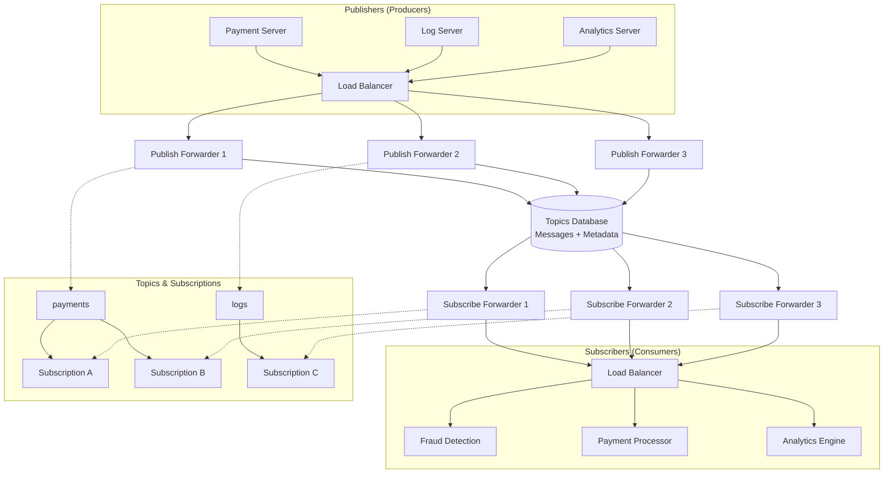
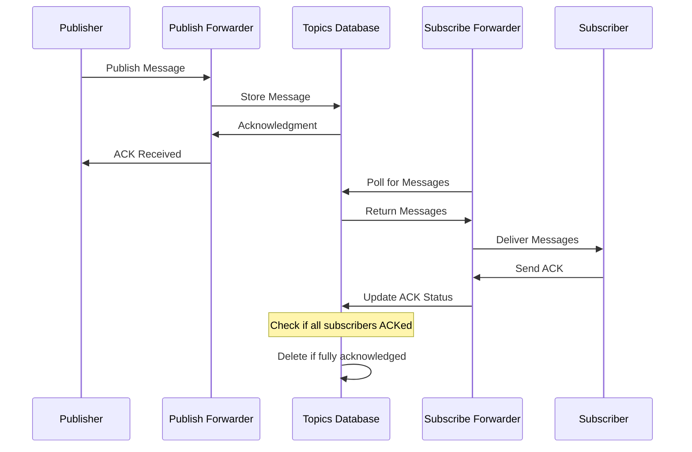

# Distributed Message Queue Design

## Summary
Comprehensive design for a distributed message queue system supporting pub/sub patterns, fan-out delivery, persistent storage, and high throughput for asynchronous message processing across distributed applications.

## Problem Statement
A distributed message queue enables asynchronous communication between decoupled application components. **Publishers** (producers) send messages to **topics**, while **subscribers** (consumers) receive messages through **subscriptions**. This solves problems of:
- **Decoupling:** Publishers don't need to know about subscribers
- **Scalability:** Handle varying loads between publishers and subscribers independently
- **Reliability:** Ensure messages are delivered even during failures
- **Performance:** Process work asynchronously to handle traffic spikes

**Key Users:**
- **Application Servers:** Publishers creating messages (e.g., payment processors)
- **Worker Services:** Subscribers consuming messages (e.g., fraud detection, analytics)
- **DevOps Teams:** Managing queue configuration and monitoring

## Scale & Constraints
- **Throughput:** Handle thousands of messages per second with low latency
- **Storage:** Persistent storage for message retention until acknowledged by all subscribers
- **Scalability:** Horizontal scaling of publishers, subscribers, and queue infrastructure
- **Availability:** High availability across multiple data centers/regions
- **Durability:** No message loss even during system failures
- **Ordering:** Maintain message order within topics for FIFO processing

## High-Level Architecture


## Detailed Design

### Core Components
- **Publish Forwarders:** Receive messages from publishers, persist to storage, send acknowledgments
- **Subscribe Forwarders:** Read messages from storage, deliver to subscribers, handle acknowledgments
- **Topics Database:** Persistent storage for messages and metadata (topics, subscriptions)
- **Metadata Store:** Track subscription states, acknowledgment status, and queue configuration
- **Load Balancers:** Distribute traffic between publishers/subscribers and forwarders

### Data Models

| Entity | Key Fields | Relationships | Purpose |
|--------|------------|---------------|---------|
| **Topics** | topic_id, name, partitions | 1:N with Messages, 1:N with Subscriptions | Organize messages by category/type |
| **Messages** | message_id, topic_id, payload, timestamp, publisher_id | N:1 with Topics | Store message content and metadata |
| **Subscriptions** | subscription_id, topic_id, subscriber_id, state | N:1 with Topics, N:1 with Subscribers | Track message delivery status |
| **Acknowledgments** | ack_id, message_id, subscription_id, timestamp | N:1 with Messages, N:1 with Subscriptions | Track delivery confirmations |

### API Design
**Publishing Endpoints:**
- `POST /topics/{topic}/messages` - Publish message to topic
- `GET /topics/{topic}/messages/{id}/ack` - Get acknowledgment status

**Subscription Endpoints:**
- `POST /topics/{topic}/subscriptions` - Create subscription
- `GET /topics/{topic}/subscriptions/{id}/messages` - Pull messages (pull-based)
- `POST /subscriptions/{id}/ack` - Acknowledge message delivery

**Message Flow:**


## Trade-offs & Alternatives

**Delivery Guarantees:**
- **At-least-once:** Ensures no message loss, but may cause duplicates
  - **Pros:** Fault-tolerant, no data loss
  - **Cons:** Duplicate processing possible, requires idempotency
  - **Why chosen:** Critical for financial/payment systems

- **At-most-once:** Prevents duplicates but may lose messages
  - **Pros:** No duplicate processing, simpler to implement
  - **Cons:** Messages may be lost during failures

- **Exactly-once:** Guarantees delivery exactly once
  - **Pros:** Perfect reliability
  - **Cons:** Complex implementation, performance overhead

**Replication Strategy:**
- **Single Replica ACK:** Fast acknowledgment, lower latency
  - **Pros:** Low latency, high throughput
  - **Cons:** Data loss if replica fails before replication

- **Multi-Replica ACK:** Wait for multiple replicas before ACK
  - **Pros:** Higher fault tolerance
  - **Cons:** Higher latency, lower throughput

**Delivery Mechanisms:**
- **Pull-based:** Subscribers poll for messages
  - **Pros:** Better for batch processing, controlled consumption
  - **Cons:** Higher latency, wasted requests

- **Push-based:** Messages pushed to subscribers immediately
  - **Pros:** Lower latency, real-time processing
  - **Cons:** May overload slow subscribers, more complex retry logic

## Scaling Strategy
- **Horizontal Scaling:** Scale publish/subscribe forwarders independently based on load
- **Database Sharding:** Shard by topic ID for even message distribution
- **Partitioning:** Partition topics across multiple database instances
- **Load Distribution:** Geographic load balancing for global deployments

## Failure Handling
- **Message Persistence:** Store messages until acknowledged by all subscribers
- **Replication:** Multi-region replication for disaster recovery
- **Circuit Breakers:** Prevent cascade failures between components
- **Dead Letter Queues:** Handle permanently failed messages
- **Monitoring:** Track acknowledgment rates, queue depth, latency metrics

## Examples / snippets

**Message Publishing Example:**
```python
import requests

def publish_message(topic: str, message: dict):
    """Publish message to topic with acknowledgment handling"""
    response = requests.post(
        f"https://mq.example.com/topics/{topic}/messages",
        json=message,
        headers={"Authorization": "Bearer <token>"}
    )

    if response.status_code == 201:
        ack_data = response.json()
        message_id = ack_data["message_id"]
        print(f"Message {message_id} acknowledged")
        return message_id
    else:
        raise Exception(f"Failed to publish: {response.text}")
```

**Message Consumption with Pull-based Delivery:**
```python
def consume_messages(subscription_id: str, max_messages: int = 10):
    """Pull messages from subscription"""
    response = requests.get(
        f"https://mq.example.com/subscriptions/{subscription_id}/messages",
        params={"max_messages": max_messages}
    )

    messages = response.json()["messages"]

    for msg in messages:
        try:
            # Process message
            process_message(msg)
            # Acknowledge successful processing
            ack_message(subscription_id, msg["message_id"])
        except Exception as e:
            print(f"Failed to process message {msg['message_id']}: {e}")

def ack_message(subscription_id: str, message_id: str):
    """Acknowledge message consumption"""
    requests.post(
        f"https://mq.example.com/subscriptions/{subscription_id}/ack",
        json={"message_id": message_id}
    )
```

## Links
- [Apache Kafka Documentation](https://kafka.apache.org/documentation/)
- [RabbitMQ Documentation](https://www.rabbitmq.com/documentation.html)
- [Google Cloud Pub/Sub](https://cloud.google.com/pubsub/docs/overview)
- [Amazon SQS Documentation](https://docs.aws.amazon.com/sqs/)
- [Message Queue vs Event Streaming - Confluent](https://www.confluent.io/blog/event-streaming-vs-message-queues/)
