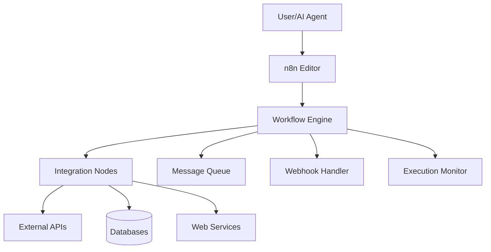

# n8n Workflow Automation

## Summary
n8n is an open-source, node-based workflow automation platform that enables users to connect various services, APIs, and tools through visual workflows. It features a fair-code licensing model and supports both cloud and self-hosted deployments, with the latest version 1.115.2 introducing the AI Workflow Builder (Beta) for natural language workflow creation.

## Overview & Architecture

### What is n8n Workflow Automation?
- **Purpose:** Visual workflow automation platform that connects disparate services and APIs through drag-and-drop nodes, enabling complex automations without extensive coding
- **Type:** Open-source workflow automation platform with fair-code licensing
- **Key Features:** Visual workflow editor, 400+ integrations, self-hosted and cloud options, AI-powered workflow generation (Beta), webhook support, and real-time execution

### Architecture Overview


### Core Components
- **Workflow Editor:** Visual drag-and-drop interface for building automation workflows
- **Node Library:** 400+ pre-built nodes for popular services (Slack, Gmail, Notion, etc.)
- **Execution Engine:** Real-time workflow execution with error handling and retry logic
- **Webhook Support:** HTTP webhook triggers for external integrations
- **Queue Management:** Background job processing and scheduling capabilities
- **AI Workflow Builder (Beta):** Natural language workflow generation using AI prompts

## Installation & Setup

### Prerequisites
- Node.js 18+ (for self-hosted installations)
- Docker (optional, for containerized deployment)
- At least 2GB RAM recommended
- Modern web browser for the UI
- SSL certificate for production HTTPS (recommended)

### Installation

#### Self-Hosted Installation
```bash
# Using npm (recommended)
npm install n8n -g

# Or using Docker
docker run -it --rm \
  --name n8n \
  -p 5678:5678 \
  -v ~/.n8n:/home/node/.n8n \
  n8nio/n8n
```

#### Cloud Installation
```bash
# Sign up at n8n.cloud
# No installation required - web-based interface
# Available on Trial, Starter, and Pro plans
```

### Initial Configuration
```yaml
# Basic n8n configuration (via environment variables)
N8N_HOST: "localhost"
N8N_PORT: 5678
N8N_PROTOCOL: "http"
N8N_EDITOR_BASE_URL: "https://your-domain.com/"

# Database configuration
DB_TYPE: "sqlite"  # or postgresdb, mysqldb
DB_SQLITE_DATABASE: "~/.n8n/database.db"

# Security settings
N8N_BASIC_AUTH_ACTIVE: "true"
N8N_BASIC_AUTH_USER: "your-username"
N8N_BASIC_AUTH_PASSWORD: "your-secure-password"

# Encryption key for credentials
N8N_ENCRYPTION_KEY: "your-32-character-encryption-key"
```

## Core Capabilities

### Primary Functions
1. **Workflow Automation:** Connect multiple services through visual node-based workflows without coding
2. **API Integration:** Trigger workflows via webhooks or schedule them to run automatically
3. **Data Transformation:** Process, filter, and transform data between different services and formats
4. **AI Workflow Builder (Beta):** Generate workflows using natural language prompts (v1.115.0+)
5. **Multi-tenant Support:** Manage multiple users and workspaces in cloud deployments

### Integration Methods

#### REST API Integration
```python
import requests

# n8n REST API client
class N8nClient:
    def __init__(self, base_url, api_key):
        self.base_url = base_url.rstrip('/')
        self.headers = {
            'X-N8N-API-KEY': api_key,
            'Content-Type': 'application/json'
        }

    def trigger_workflow(self, workflow_id, data=None):
        url = f"{self.base_url}/rest/workflows/{workflow_id}/execute"
        response = requests.post(url, json=data or {}, headers=self.headers)
        return response.json()

# Usage
client = N8nClient("https://your-n8n-instance.com", "your-api-key")
result = client.trigger_workflow("workflow-id", {"input": "data"})
```

#### Webhook Integration
```javascript
// n8n webhook trigger (no SDK needed)
const express = require('express');
const app = express();

app.use(express.json());

// Webhook endpoint for n8n
app.post('/webhook/n8n-trigger', (req, res) => {
  console.log('Received webhook:', req.body);

  // Process the webhook data and trigger n8n workflow
  triggerN8nWorkflow(req.body);

  res.json({ status: 'received' });
});

function triggerN8nWorkflow(data) {
  // Custom logic to trigger n8n workflow
  // via REST API or direct execution
}
```

#### REST API
```bash
# Direct API calls to trigger workflows
curl -X POST https://your-n8n-instance.com/rest/workflows/workflow-id/execute \
  -H "X-N8N-API-KEY: your-api-key" \
  -H "Content-Type: application/json" \
  -d '{"inputData": {"message": "Hello from API"}}'

# Get workflow executions
curl https://your-n8n-instance.com/rest/executions \
  -H "X-N8N-API-KEY: your-api-key"
```

## Configuration & Customization

### Advanced Configuration
```json
{
  "database": {
    "type": "postgresdb",
    "connection": {
      "host": "localhost",
      "port": 5432,
      "database": "n8n",
      "user": "n8n_user",
      "password": "secure_password"
    }
  },
  "executions": {
    "saveDataOnError": "all",
    "saveDataOnSuccess": "none",
    "saveExecutionProgress": true,
    "timeout": 3600
  },
  "generic": {
    "timezone": "America/New_York",
    "memoryLimit": "2048MB"
  }
}
```

### Environment Variables
```bash
# Database
export DB_TYPE="postgresdb"
export DB_POSTGRESDB_HOST="localhost"
export DB_POSTGRESDB_PORT="5432"
export DB_POSTGRESDB_DATABASE="n8n"
export DB_POSTGRESDB_USER="n8n_user"
export DB_POSTGRESDB_PASSWORD="secure_password"

# Security & Auth
export N8N_BASIC_AUTH_ACTIVE="true"
export N8N_BASIC_AUTH_USER="admin"
export N8N_BASIC_AUTH_PASSWORD="very_secure_password"
export N8N_ENCRYPTION_KEY="32-character-encryption-key-here"

# Performance
export N8N_EXECUTIONS_TIMEOUT="3600"
export NODE_OPTIONS="--max-old-space-size=2048"
```

## Usage Examples

### Basic Workflows
1. **Data Sync:** Automatically sync data between Google Sheets and Airtable on schedule
2. **Notification System:** Send Slack notifications when new GitHub issues are created
3. **Content Processing:** Download RSS feeds, process articles, and post to social media
4. **AI-Powered Workflows:** Use natural language prompts to generate workflow drafts (Beta feature)

### Code Examples

#### JavaScript/Node.js Workflow Creation
```javascript
// Example: Create a Slack notification workflow programmatically
const n8n = require('n8n');

const workflow = {
  name: 'GitHub Issue Notifier',
  nodes: [
    {
      id: 'trigger',
      type: 'n8n-nodes-base.webhook',
      position: [100, 100],
      parameters: {
        httpMethod: 'POST',
        path: 'github-issue'
      }
    },
    {
      id: 'filter',
      type: 'n8n-nodes-base.filter',
      position: [300, 100],
      parameters: {
        conditions: {
          boolean: [
            {
              column: 'action',
              value: 'opened'
            }
          ]
        }
      }
    },
    {
      id: 'slack',
      type: 'n8n-nodes-base.slack',
      position: [500, 100],
      parameters: {
        action: 'sendMessage',
        channel: '#alerts',
        text: 'New GitHub issue: {{ $node["filter"].json.title }}'
      }
    }
  ],
  connections: {
    'trigger': {
      'main': [
        [{ node: 'filter', type: 'main', index: 0 }]
      ]
    },
    'filter': {
      'main': [
        [{ node: 'slack', type: 'main', index: 0 }]
      ]
    }
  }
};

// Deploy workflow via REST API
await n8n.deployWorkflow(workflow);
```

#### AI Workflow Builder Example
```javascript
// Using the new AI Workflow Builder (Beta)
const aiBuilder = n8n.aiBuilder();

const prompt = `
Create a workflow that:
1. Monitors a Gmail inbox for new emails
2. Extracts email content and sender info
3. If email contains "urgent", send Slack notification
4. Save email data to Google Sheets
`;

const workflowDraft = await aiBuilder.generateWorkflow({
  prompt: prompt,
  context: {
    gmailAccount: 'work@gmail.com',
    slackWebhook: 'https://hooks.slack.com/...',
    sheetsId: '1ABC...'
  }
});

// Refine and deploy
const refinedWorkflow = await aiBuilder.refineWorkflow(workflowDraft, {
  addNode: {
    type: 'filter',
    condition: 'priority === "high"'
  }
});

await n8n.deployWorkflow(refinedWorkflow);
```

#### Webhook Integration Example
```bash
# Set up webhook trigger for external systems
curl -X POST https://your-n8n-instance.com/webhook/github-issue \
  -H "Content-Type: application/json" \
  -d '{
    "action": "opened",
    "issue": {
      "title": "Bug: Application crashes on login",
      "number": 123,
      "user": {"login": "reporter"}
    }
  }'
```

## Integration Patterns

### MCP (Model Context Protocol) Integration
```typescript
// n8n can integrate with MCP-compatible tools via HTTP nodes
// Example: Connect to MCP-enabled services through webhooks

import { MCPClient } from '@modelcontextprotocol/sdk';
import n8nAPI from 'n8n-api';

const mcpClient = new MCPClient({
  server: 'localhost:8080',
  capabilities: ['read', 'write', 'search']
});

// Register MCP tools with n8n workflow
await mcpClient.registerTools([
  {
    name: 'n8n_workflow_trigger',
    description: 'Trigger n8n workflows from MCP tools',
    handler: async (params) => {
      // Trigger n8n workflow via REST API
      return await n8nAPI.triggerWorkflow({
        workflowId: params.workflowId,
        data: params.inputData
      });
    }
  }
]);
```

### External Service Integration Pattern
```json
{
  "name": "MCP Service Integration",
  "nodes": [
    {
      "id": "webhook",
      "type": "n8n-nodes-base.webhook",
      "position": [100, 100],
      "parameters": {
        "httpMethod": "POST",
        "path": "mcp-integration"
      }
    },
    {
      "id": "http",
      "type": "n8n-nodes-base.httpRequest",
      "position": [300, 100],
      "parameters": {
        "method": "POST",
        "url": "https://mcp-service.example.com/api/execute",
        "headers": {
          "Authorization": "Bearer {{ $credentials.apiKey }}",
          "Content-Type": "application/json"
        },
        "bodyParameters": {
          "action": "process",
          "data": "{{ $node[\"webhook\"].json }}"
        }
      }
    }
  ],
  "connections": {
    "webhook": {
      "main": [
        [{ "node": "http", "type": "main", "index": 0 }]
      ]
    }
  }
}
```

## Best Practices & Guidelines

### Design Patterns
- **Error Handling:** Use try-catch nodes and set up proper fallback workflows for critical processes
- **Modular Workflows:** Break complex workflows into sub-workflows for better maintainability
- **Webhook Security:** Always validate webhook signatures and use proper authentication
- **Idempotency:** Design workflows to handle duplicate triggers gracefully

### Performance Optimization
- Use pagination for large datasets to avoid memory issues
- Implement rate limiting for API calls to external services
- Use the Queue Mode for resource-intensive workflows
- Optimize node execution order to minimize API calls

### Security Considerations
- Store API keys and sensitive data in n8n credentials, never in plain text
- Use HTTPS for all webhook endpoints in production
- Implement proper authentication for workflow access
- Regularly rotate API keys and encryption keys
- Use environment-specific configurations for different deployment stages

## Error Handling & Debugging

### Common Issues

| Issue | Symptom | Solution |
|-------|---------|----------|
| **Node Execution Failed** | Red X on node in editor | Check node parameters and credentials |
| **Webhook Timeout** | Workflow doesn't trigger | Increase timeout settings or use async patterns |
| **Memory Error** | Out of memory during execution | Enable pagination or use Queue Mode |
| **Rate Limiting** | External API returns 429 errors | Add delays between API calls |
| **Authentication Error** | 401/403 responses from APIs | Verify API keys and permissions |

### Debugging Commands
```bash
# Check n8n logs (self-hosted)
tail -f ~/.n8n/logs/*.log

# Test webhook endpoint
curl -X POST https://your-n8n-instance.com/webhook/test \
  -H "Content-Type: application/json" \
  -d '{"test": "data"}'

# Check workflow executions via API
curl https://your-n8n-instance.com/rest/executions?limit=10 \
  -H "X-N8N-API-KEY: your-api-key"
```

### Monitoring & Logging
```javascript
// Enable detailed logging in n8n workflow
const executionData = {
  executionId: $execution.id,
  workflowName: $execution.workflowName,
  startTime: new Date().toISOString()
};

// Log to n8n execution data
$execution.setData('debugInfo', executionData);

// Custom error logging
if (error) {
  $execution.setData('error', {
    message: error.message,
    stack: error.stack,
    node: $node.name
  });
}
```

## Advanced Features

### Custom Node Development
```javascript
// Example: Create a custom n8n node
const CustomNode = {
  name: 'Custom Processor',
  description: 'Custom data processing node',
  version: 1,
  defaults: {
    name: 'Custom Processor',
    color: '#ff6b35'
  },
  inputs: ['main'],
  outputs: ['main'],
  credentials: [
    {
      name: 'customApi',
      required: true
    }
  ],
  properties: [
    {
      displayName: 'Operation',
      name: 'operation',
      type: 'options',
      options: [
        { name: 'Process', value: 'process' },
        { name: 'Transform', value: 'transform' }
      ],
      default: 'process'
    }
  ],
  async execute() {
    const operation = this.getNodeParameter('operation');

    if (operation === 'process') {
      // Custom processing logic
      const processedData = await customAPI.process(this.getInputData());
      return [processedData];
    }
  }
};
```

### AI Workflow Builder (Beta)
```javascript
// Use the new AI-powered workflow generation
const aiBuilder = n8n.aiBuilder();

const workflowPrompt = `
I need a workflow that monitors Twitter for mentions of my company,
analyzes sentiment, and sends positive mentions to Slack while
saving all mentions to a Google Sheet.
`;

const workflow = await aiBuilder.create({
  prompt: workflowPrompt,
  integrations: ['twitter', 'google-sheets', 'slack'],
  preferences: {
    complexity: 'intermediate',
    errorHandling: 'comprehensive'
  }
});

// The AI will generate a complete workflow with all necessary nodes
console.log(workflow.nodes.length, 'nodes created');
```

## Ecosystem & Community

### Related Tools & Integrations
- **Zapier:** Similar workflow automation, but n8n offers more customization and self-hosting
- **Make (Integromat):** Visual workflow builder with similar node-based approach
- **Microsoft Power Automate:** Enterprise-focused automation with extensive Microsoft ecosystem support
- **Node-RED:** Open-source flow-based programming tool, more developer-focused than n8n

### Community Resources
- **Official Documentation:** docs.n8n.io - Comprehensive guides and API reference
- **Community Forum:** community.n8n.io - User discussions and troubleshooting
- **GitHub Repository:** github.com/n8n-io/n8n - Source code and issue tracking
- **YouTube Channel:** n8n tutorials and feature demos
- **Discord Community:** Active developer and user community discussions

## Examples / snippets

### Real-world Examples
- **E-commerce Automation:** Automatically process orders, update inventory, send confirmation emails, and sync data across multiple platforms
- **Social Media Management:** Monitor brand mentions across platforms, analyze sentiment, and route important messages to appropriate teams
- **Data Pipeline:** Extract data from various sources (APIs, databases, files), transform it, and load into data warehouses or analytics platforms
- **Customer Support:** Automatically categorize support tickets, route to appropriate agents, and trigger follow-up workflows

### Configuration Snippets
```json
{
  "executions": {
    "saveDataOnError": "all",
    "saveDataOnSuccess": "none",
    "saveExecutionProgress": true,
    "timeout": 3600,
    "maxConcurrency": 10
  },
  "generic": {
    "timezone": "America/New_York",
    "memoryLimit": "2048MB",
    "maxPayloadSize": "10MB"
  },
  "security": {
    "encryptionKey": "32-character-encryption-key-here",
    "csrfSecret": "csrf-secret-here",
    "jwtSecret": "jwt-secret-here"
  }
}
```

## Links
- [Official Documentation](https://docs.n8n.io/) - Complete guides and API reference
- [n8n Cloud](https://n8n.cloud/) - Hosted version with AI Workflow Builder (Beta)
- [GitHub Repository](https://github.com/n8n-io/n8n) - Source code and issue tracking
- [Community Forum](https://community.n8n.io/) - User discussions and support
- [Release Notes](https://docs.n8n.io/release-notes/) - Latest features and updates
- [YouTube Channel](https://www.youtube.com/c/n8n-io) - Video tutorials and demos
- [Discord Community](https://discord.gg/n8n) - Real-time chat and support
- [Template Library](https://n8n.io/workflows/) - Pre-built workflow templates
