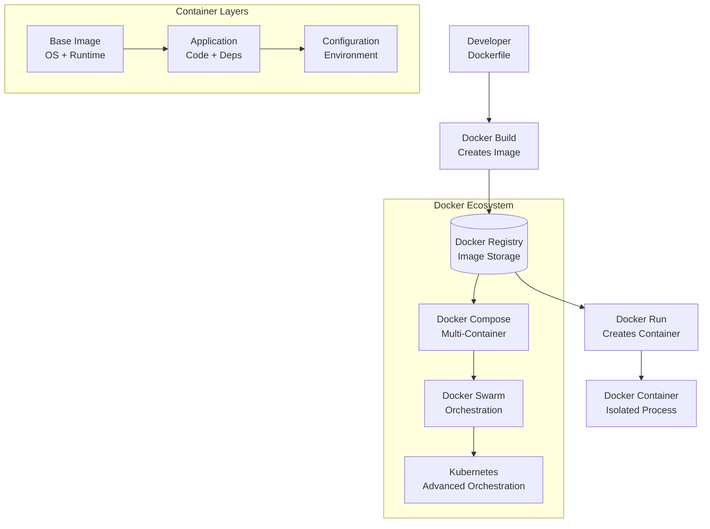

# Docker Containers

## Summary
Docker is a containerization platform that packages applications and their dependencies into lightweight, portable containers, enabling consistent deployment across different environments and simplifying DevOps workflows.

## Problem Statement
Traditional application deployment faces challenges with "it works on my machine" issues, environment inconsistencies, and dependency conflicts. Docker solves these problems by providing isolated, reproducible environments that package applications with all their dependencies, ensuring consistent behavior across development, testing, and production environments.

## Key Concepts & Architecture

### Core Components
- **Docker Engine:** The runtime that builds and runs containers
- **Docker Images:** Read-only templates used to create containers
- **Docker Containers:** Runnable instances of Docker images
- **Dockerfile:** Text file with instructions for building Docker images
- **Docker Registry:** Storage and distribution system for Docker images
- **Docker Compose:** Tool for defining and running multi-container applications

### Architecture Overview


## Configuration & Setup

### Prerequisites
- Linux, macOS, or Windows with Docker Desktop
- Basic understanding of command line operations
- Text editor for creating Dockerfiles

### Installation & Configuration
```bash
# Install Docker Desktop (includes Docker Engine, CLI, Compose)
# Download from: https://www.docker.com/products/docker-desktop/

# Verify installation
docker --version
docker-compose --version

# Basic configuration (optional)
mkdir -p ~/.docker
echo '{"experimental": "enabled"}' > ~/.docker/config.json
```

### Basic Dockerfile
```dockerfile
# Use official Node.js runtime as base image
FROM node:18-alpine

# Set working directory in container
WORKDIR /app

# Copy package files first for better layer caching
COPY package*.json ./

# Install dependencies (this layer cached if package.json doesn't change)
RUN npm ci --only=production

# Copy application code
COPY . .

# Create non-root user for security
RUN addgroup -g 1001 -S nodejs
RUN adduser -S nextjs -u 1001

USER nextjs

# Expose port
EXPOSE 3000

# Health check
HEALTHCHECK --interval=30s --timeout=3s --start-period=5s --retries=3 \
  CMD curl -f http://localhost:3000/api/health || exit 1

# Start the application
CMD ["npm", "start"]
```

### Docker Compose Configuration
```yaml
# docker-compose.yml
version: '3.8'
services:
  web:
    build: .
    ports:
      - "3000:3000"
    environment:
      - NODE_ENV=production
      - DATABASE_URL=postgresql://user:pass@db:5432/mydb
    depends_on:
      - db
    volumes:
      - ./logs:/app/logs

  db:
    image: postgres:15-alpine
    environment:
      - POSTGRES_DB=mydb
      - POSTGRES_USER=user
      - POSTGRES_PASSWORD=pass
    volumes:
      - db_data:/var/lib/postgresql/data
    ports:
      - "5432:5432"

  redis:
    image: redis:7-alpine
    ports:
      - "6379:6379"
    volumes:
      - redis_data:/data

volumes:
  db_data:
  redis_data:
```

## Usage Examples

### Common Workflows

1. **Development Workflow:** Use Docker Compose for local development with hot reloading
2. **Production Deployment:** Build optimized images and deploy to container orchestration platforms
3. **CI/CD Integration:** Build and push images as part of automated pipelines

### Code Examples

#### Node.js Application
```javascript
// app.js
const express = require('express');
const app = express();
const port = process.env.PORT || 3000;

app.get('/api/health', (req, res) => {
  res.json({
    status: 'healthy',
    timestamp: new Date().toISOString(),
    version: process.env.APP_VERSION || '1.0.0'
  });
});

app.get('/api/data', async (req, res) => {
  // Simulate database call
  const data = {
    message: 'Hello from Docker container!',
    container_id: process.env.HOSTNAME
  };
  res.json(data);
});

app.listen(port, () => {
  console.log(`Server running on port ${port} in container ${process.env.HOSTNAME}`);
});
```

#### Multi-stage Dockerfile for Optimization
```dockerfile
# Build stage
FROM node:18-alpine AS builder
WORKDIR /app
COPY package*.json ./
RUN npm ci
COPY . .
RUN npm run build

# Production stage
FROM node:18-alpine AS production
WORKDIR /app

# Create app user for security
RUN addgroup -g 1001 -S nodejs && \
    adduser -S nextjs -u 1001

# Copy package files
COPY package*.json ./

# Install only production dependencies
RUN npm ci --only=production && \
    npm cache clean --force

# Copy built application from builder stage
COPY --from=builder /app/dist ./dist

USER nextjs

EXPOSE 3000

CMD ["node", "dist/server.js"]
```

## Best Practices & Guidelines

### Recommended Patterns
- **Multi-stage Builds:** Use multiple stages for optimization and security
- **Layer Caching:** Order instructions to maximize cache utilization
- **Minimal Base Images:** Use Alpine or slim variants when possible
- **Non-root User:** Always run containers as non-root for security
- **Health Checks:** Implement proper health checks for orchestration
- **Environment Variables:** Use env vars instead of hardcoded values

### Security Considerations
- **Vulnerability Scanning:** Regularly scan images for vulnerabilities
- **Secret Management:** Never store secrets in images, use volumes or env vars
- **Image Signing:** Sign and verify image authenticity
- **Network Security:** Use private registries and access controls

```bash
# Security scanning
docker scan myimage:tag

# Run as non-root
RUN useradd -r -u 1001 -g nodejs nodejs
USER nodejs
```

### Performance Optimization
- **Image Size:** Minimize layers and use appropriate base images
- **Caching Strategy:** Copy package.json first, then install dependencies
- **Resource Limits:** Set appropriate CPU and memory limits
- **Health Checks:** Implement efficient health check endpoints

```dockerfile
# Optimized Dockerfile
FROM node:18-alpine AS deps
WORKDIR /app
COPY package.json package-lock.json ./
RUN npm ci --frozen-lockfile

FROM node:18-alpine AS builder
WORKDIR /app
COPY --from=deps /app/node_modules ./node_modules
COPY . .
RUN npm run build

FROM node:18-alpine AS runner
WORKDIR /app
RUN addgroup --system --gid 1001 nodejs
RUN adduser --system --uid 1001 nextjs

COPY --from=builder /app/public ./public
COPY --from=builder --chown=nextjs:nodejs /app/.next/standalone ./
COPY --from=builder --chown=nextjs:nodejs /app/.next/static ./.next/static

USER nextjs
EXPOSE 3000
CMD ["node", "server.js"]
```

## Troubleshooting & Common Issues

### Common Problems

| Issue | Symptom | Solution |
|-------|---------|----------|
| **Image won't build** | Build fails with cryptic errors | Check Dockerfile syntax and layer order |
| **Container won't start** | Container exits immediately | Review logs with `docker logs <container>` |
| **Port conflicts** | Port already in use | Use different host ports or stop conflicting containers |
| **Out of disk space** | Build fails due to storage | Clean up unused images and containers |

### Debugging Commands
```bash
# View running containers
docker ps -a

# View container logs
docker logs -f container_name

# Execute into running container
docker exec -it container_name /bin/sh

# View image layers
docker history image_name

# Clean up unused resources
docker system prune -a

# Debug build process
docker build --no-cache --progress=plain -t myimage .
```

## Integration & Ecosystem

### Related Tools
- **Docker Compose:** Multi-container application definition
- **Kubernetes:** Container orchestration and management
- **Docker Registry:** Private image storage and distribution
- **Docker Swarm:** Native Docker clustering and orchestration

### CI/CD Integration Examples

#### GitHub Actions with Docker
```yaml
# Build and push Docker image
- name: Build and Push Docker Image
  run: |
    docker build -t myregistry/myapp:${{ github.sha }} .
    docker tag myregistry/myapp:${{ github.sha }} myregistry/myapp:latest
    docker push myregistry/myapp:${{ github.sha }}
    docker push myregistry/myapp:latest
```

#### Docker in Production
```yaml
# Kubernetes deployment with Docker image
apiVersion: apps/v1
kind: Deployment
metadata:
  name: myapp
spec:
  replicas: 3
  selector:
    matchLabels:
      app: myapp
  template:
    metadata:
      labels:
        app: myapp
    spec:
      containers:
      - name: myapp
        image: myregistry/myapp:v1.2.3
        ports:
        - containerPort: 3000
        resources:
          requests:
            memory: "128Mi"
            cpu: "250m"
          limits:
            memory: "256Mi"
            cpu: "500m"
```

## Trade-offs & Alternatives

### Alternative Approaches
- **Virtual Machines:** Full OS virtualization with higher overhead
  - **Pros:** Complete isolation, familiar tooling
  - **Cons:** Resource intensive, slower startup, larger footprint
  - **When to use:** Legacy applications, specific OS requirements

- **Serverless Functions:** Event-driven execution without infrastructure management
  - **Pros:** Auto-scaling, pay-per-use, minimal ops overhead
  - **Cons:** Cold start latency, vendor lock-in, stateless by default
  - **When to use:** Event-driven workloads, microservices

### Decision Framework
- **Choose Docker when:** Need consistent environments, microservices architecture, DevOps maturity
- **Consider alternatives when:** Simple applications, legacy systems, serverless-first approach

## Monitoring & Observability

### Key Metrics
- **Container CPU/Memory Usage:** Resource consumption monitoring
- **Container Start/Stop Events:** Lifecycle tracking
- **Image Pull/Push Times:** Registry performance
- **Build Success Rates:** CI/CD pipeline health

### Alerting Setup
- **Resource Thresholds:** Alert on high CPU/memory usage
- **Container Health:** Monitor health check failures
- **Registry Issues:** Alert on image pull failures

## Advanced Topics

### Deep Dive Sections

#### Multi-stage Build Optimization
```dockerfile
# Comprehensive multi-stage build
FROM golang:1.21-alpine AS builder
WORKDIR /app
COPY go.* ./
RUN go mod download
COPY . .
RUN CGO_ENABLED=0 GOOS=linux go build -o app .

FROM alpine:latest AS runtime
RUN apk --no-cache add ca-certificates
WORKDIR /root/
COPY --from=builder /app/app .
CMD ["./app"]
```

#### Docker Security Scanning
```yaml
# Security scanning pipeline
- name: Security Scan
  run: |
    docker pull myimage:latest
    docker scan myimage:latest > security-report.json

- name: Upload Security Report
  uses: actions/upload-artifact@v3
  with:
    name: security-report
    path: security-report.json
```

## Examples / snippets

### Real-world Examples
- **Netflix:** Uses Docker for microservices deployment across global infrastructure
- **Spotify:** Migrated from VMs to containers for faster deployments and better resource utilization
- **Airbnb:** Uses Docker for consistent development and production environments

### Configuration Snippets

#### Production-ready Docker Compose
```yaml
version: '3.8'
services:
  api:
    build:
      context: .
      dockerfile: Dockerfile.prod
    deploy:
      replicas: 3
      resources:
        limits:
          cpus: '0.5'
          memory: 512M
        reservations:
          cpus: '0.25'
          memory: 256M
    healthcheck:
      test: ["CMD", "curl", "-f", "http://localhost:3000/health"]
      interval: 30s
      timeout: 10s
      retries: 3
      start_period: 40s

  load-balancer:
    image: nginx:alpine
    ports:
      - "80:80"
    volumes:
      - ./nginx.conf:/etc/nginx/nginx.conf:ro
    depends_on:
      - api
```

## Flashcards

- What is the main purpose of Docker containers? ::: To package applications and their dependencies into lightweight, portable, and isolated environments
- What is a Docker image? ::: A read-only template that contains the application code, runtime, libraries, and configuration files needed to run a container
- What is a Docker container? ::: A runnable instance of a Docker image that provides an isolated process with its own filesystem and network
- What is the purpose of a Dockerfile? ::: To define the steps needed to create a Docker image through a series of instructions
- What is the difference between a Docker image and a container? ::: An image is the static blueprint/template, while a container is the running instance created from that image
- What are the main benefits of using Docker? ::: Portability, consistency across environments, isolation, scalability, and simplified dependency management
- What is Docker Compose used for? ::: To define and run multi-container Docker applications using a YAML configuration file
- What is the purpose of Docker volumes? ::: To persist data generated by and used by Docker containers beyond their lifecycle
- What is the difference between COPY and ADD instructions in Dockerfile? ::: COPY copies files from host to image, while ADD can also download files from URLs and extract archives
- What is the purpose of the EXPOSE instruction in Dockerfile? ::: To inform Docker that the container listens on specified network ports at runtime
- What is the difference between ENTRYPOINT and CMD in Dockerfile? ::: ENTRYPOINT defines the executable, while CMD provides default arguments that can be overridden
- What is Docker layering? ::: The concept where each Dockerfile instruction creates a new layer in the image, allowing for caching and reusability
- What is the purpose of multi-stage builds in Docker? ::: To create smaller, more efficient images by using multiple FROM statements and copying only necessary artifacts
- What is the role of a Docker registry? ::: To store, distribute, and manage Docker images across different environments and teams
- What are some common Docker security best practices? ::: Run containers as non-root users, use minimal base images, scan for vulnerabilities, and limit resource usage

## Links
- [Docker Official Documentation](https://docs.docker.com/)
- [Docker Best Practices](https://docs.docker.com/develop/dev-best-practices/)
- [Docker Security](https://docs.docker.com/engine/security/)
- [Docker Compose Documentation](https://docs.docker.com/compose/)
- [Docker Registry Documentation](https://docs.docker.com/registry/)
- [Container Security Best Practices](https://kubernetes.io/docs/concepts/security/)
