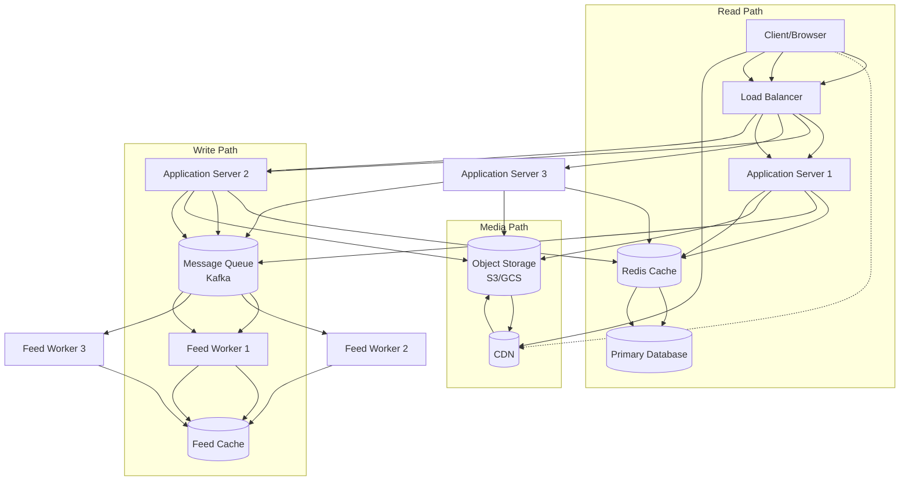
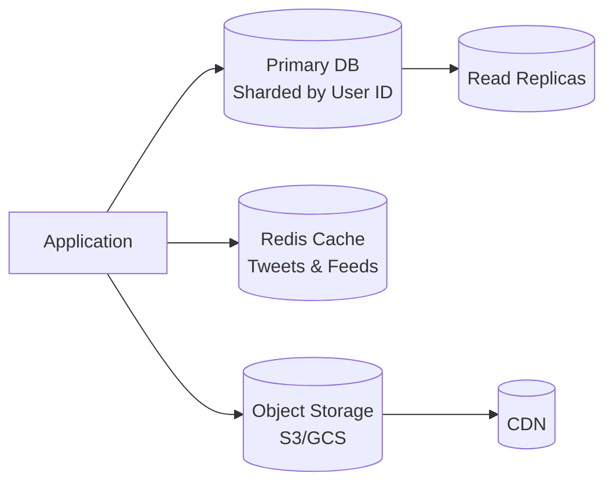
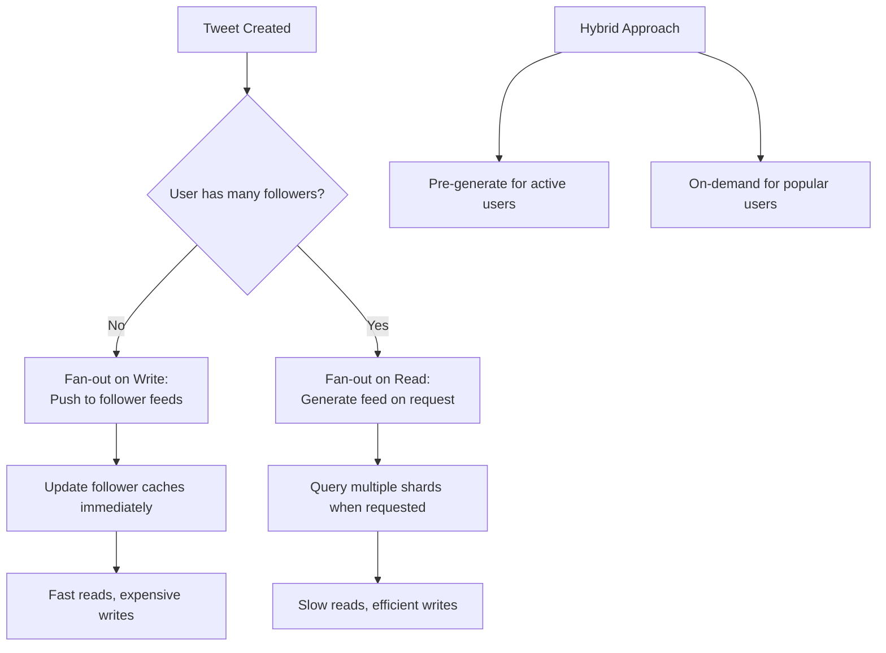

# Twitter System Design

## Summary
Comprehensive system design for Twitter, covering functional requirements, non-functional requirements with traffic estimates, high-level architecture, database design, sharding strategies, caching mechanisms, and feed generation approaches for a read-heavy social media platform.

## Details

### Background and Context
Twitter is a social network where users can follow other users and view tweets from people they follow. The system is extremely read-heavy, with most users viewing content rather than creating it. Popular users may have millions of followers, creating challenges for distributing their tweets efficiently.

### Functional Requirements
**Core Features:**
- **User Following:** Users can follow/unfollow other users
- **Tweet Creation:** Users can post tweets with text, images, and videos
- **News Feed:** Users can view tweets from people they follow in chronological order

**Tweet Content:**
- Text content (140 characters limit)
- Media attachments (images, videos)
- Metadata (user info, timestamps, engagement metrics)

### Non-Functional Requirements
**Scale Estimates:**
- 500 million total users
- 200 million daily active users (40% activity rate)
- 20 billion tweet reads per day (100 tweets per user)
- 50 million tweets created per day
- Average tweet size: ~1KB (text) + media references

**Performance Requirements:**
- Low latency for feed loading
- High availability (24/7 operation)
- Eventual consistency acceptable for reads

### High-Level Design
**Core Components:**
- **Load Balancers:** Distribute requests across application servers
- **Application Servers:** Handle business logic (stateless, horizontally scalable)
- **Database Layer:** Store user data, tweets, and relationships
- **Caching Layer:** Redis for frequently accessed tweets and feeds
- **Message Queues:** Kafka for asynchronous processing (tweet fan-out)
- **Object Storage:** S3/GCS for media files
- **CDN:** Distribute static media assets globally

**System Architecture:**



### Database Design and Storage Strategy

**Core Tables & Relationships:**

| Table | Key Fields | Purpose | Relationships |
|-------|------------|---------|---------------|
| **users** | user_id (PK), username, email, created_at | Store user account information | 1:N with tweets, N:N with follows |
| **tweets** | tweet_id (PK), user_id (FK), content, media_urls, created_at | Store tweet content and metadata | N:1 with users, 1:N with engagements |
| **follows** | follower_id (FK), followee_id (FK), created_at | Track follower relationships | N:N through junction table |

**Key Design Decisions:**
- **Sharding Strategy:** User-based sharding to co-locate user data and relationships
- **Indexing:** Follower-based indexes for efficient feed queries
- **Consistency:** Eventual consistency acceptable for social features

**Storage Architecture:**


**Media Storage:**
- Object storage (S3/GCS) for images and videos
- CDN for global distribution with pull-based invalidation

### API Design
**Core Endpoints:**
- `POST /tweets` - Create tweet
- `GET /feed?user_id=X&limit=20&offset=0` - Get user feed
- `POST /follow` - Follow user

**Request/Response Examples:**
```json
// Create Tweet Request
POST /tweets
{
  "content": "Hello world!",
  "media_urls": ["s3://bucket/image1.jpg"]
}

// Feed Response
GET /feed?user_id=123&limit=20
{
  "tweets": [
    {
      "tweet_id": "456",
      "user_id": "789",
      "content": "Tweet content...",
      "media_urls": ["cdn://image1.jpg"],
      "created_at": "2025-10-10T10:00:00Z"
    }
  ]
}
```

### Sharding and Replication Strategy
**Sharding Strategy:**
- **Shard Key:** User ID (both tweets and follows tables)
- **Benefit:** Users' data co-located on same shard
- **Query Pattern:** Range queries on follower relationships

**Replication:**
- **Read Replicas:** Multiple read-only copies for horizontal read scaling
- **Write Strategy:** Single leader with asynchronous replication
- **Consistency:** Eventual consistency acceptable (5-20 second delays OK)

**Scaling Numbers:**
- 50M tweets/day = ~500-5000 writes/second (with peaks)
- Sharding enables parallel processing across multiple database instances

### Caching Strategy
**Multi-Level Caching:**
1. **Tweet Cache:** Individual tweet content with LRU eviction
2. **Feed Cache:** Pre-computed user feeds for low latency

**Cache Population:**
- **Synchronous:** Popular tweets cached immediately
- **Asynchronous:** Feed updates via message queue workers

**Cache Challenges:**
- Hot users (celebrities) with millions of followers
- Feed pagination and real-time updates
- Concurrent cache modifications

### Feed Generation Approaches
**Option 1: Fan-out on Write**
- Push tweets to all followers' feeds when posted
- Fast reads but expensive for popular users
- Good for: Users with moderate follower counts

**Option 2: Fan-out on Read**
- Generate feed dynamically when requested
- Query multiple shards and merge results
- Higher read latency but efficient writes

**Hybrid Approach:**
- Pre-generate feeds for active users asynchronously
- Handle popular users with on-demand generation
- Use message queues for feed updates

**Algorithm Considerations:**
- Chronological ordering by creation time
- Pagination support for infinite scroll
- Background feed refresh for active users

### Advanced Considerations
**Graph Database Alternative:**
- Use graph DB for follower relationships (adjacency list model)
- Easier traversal of follow networks
- Trade-off: Complexity vs. relational query flexibility

**Real-world Evolution:**
- Twitter's design evolved significantly over time
- Changes in data storage, relationship modeling, and feed algorithms
- Continuous optimization based on usage patterns

### Trade-offs and Design Decisions
**Key Architectural Choices:**
1. **Relational vs NoSQL:** Structured relationships favor relational
2. **Sharding Strategy:** User-based for co-location benefits
3. **Consistency Model:** Eventual consistency for performance
4. **Feed Generation:** Hybrid approach balancing read/write efficiency

**Scalability Challenges:**
- Hot user problem (celebrity tweets)
- Read amplification (feed queries)
- Cache invalidation and consistency

## Examples / snippets

**Feed Generation Approaches:**



**Data Flow Example:**
```python
# Simplified feed generation logic
def get_user_feed(user_id: int, limit: int = 20) -> List[Tweet]:
    """
    Hybrid approach: Check cache first, fallback to DB query
    """
    # Try cache first for low latency
    cached_feed = redis_client.get(f"feed:{user_id}")
    if cached_feed:
        return cached_feed[:limit]

    # Fallback: Generate from database
    followee_ids = get_followees(user_id)
    tweets = []

    for followee_id in followee_ids:
        # Query user's tweets across shards
        user_tweets = query_tweets_by_user(followee_id, limit)
        tweets.extend(user_tweets)

    # Sort by recency and return
    tweets.sort(key=lambda t: t.created_at, reverse=True)

    # Background: Update cache for next time
    cache_feed_async(user_id, tweets)

    return tweets[:limit]
```

## Links
- [Designing Twitter - A System Design Interview Question - GeeksforGeeks](https://www.geeksforgeeks.org/design-twitter-a-system-design-interview-question/)
- [Design Twitter Interview Question for Amazon](https://www.jointaro.com/interviews/amazon/design-twitter/)
- [Design Twitter: System Design Interview Question - EnjoyAlgorithms](https://www.enjoyalgorithms.com/blog/design-twitter/)
- [Twitter Engineering Blog - Infrastructure Papers](https://blog.twitter.com/engineering)
