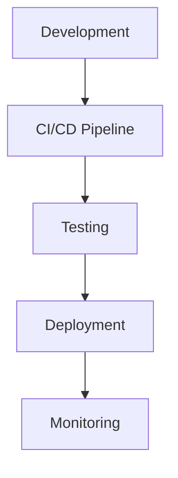

# {{TITLE}}

## Summary
Brief overview of the DevOps concept, tool, or practice and its role in modern software delivery.

## Problem Statement
What operational challenge does this solve? What inefficiencies does it address in the software development lifecycle?

## Key Concepts & Architecture

### Core Components
- **Component Name:** Purpose and key features
- **Component Name:** Purpose and key features

### Architecture Overview


## Configuration & Setup

### Prerequisites
- Required dependencies, versions, and environment setup

### Installation & Configuration
```bash
# Installation commands
npm install package-name
# or
pip install package-name
```

### Basic Configuration
```yaml
# Example configuration file
name: example-config
version: 1.0.0
settings:
  option1: value1
  option2: value2
```

## Usage Examples

### Common Workflows
1. **Workflow Pattern:** Step-by-step process description
2. **Integration Pattern:** How it works with other tools
3. **Best Practice:** Recommended approach

### Code Examples
```python
# Example implementation
def example_function():
    """
    Example function demonstrating usage
    """
    # Implementation here
    pass

# Usage
result = example_function()
```

```dockerfile
# Example Dockerfile
FROM node:18-alpine
WORKDIR /app
COPY package*.json ./
RUN npm install
COPY . .
EXPOSE 3000
CMD ["npm", "start"]
```

## Best Practices & Guidelines

### Recommended Patterns
- **Pattern 1:** Description and rationale
- **Pattern 2:** Description and rationale

### Security Considerations
- Authentication and authorization
- Secret management
- Network security

### Performance Optimization
- Caching strategies
- Resource optimization
- Scaling considerations

## Troubleshooting & Common Issues

### Common Problems

| Issue | Symptom | Solution |
|-------|---------|----------|
| **Issue 1** | Symptom description | Solution steps |
| **Issue 2** | Symptom description | Solution steps |

### Debugging Commands
```bash
# Diagnostic commands
kubectl logs pod-name
docker ps -a
npm run debug
```

## Integration & Ecosystem

### Related Tools
- **Tool 1:** How it complements this technology
- **Tool 2:** Integration patterns and use cases

### CI/CD Integration
```yaml
# GitHub Actions example
name: CI/CD Pipeline
on: [push, pull_request]
jobs:
  build-and-deploy:
    runs-on: ubuntu-latest
    steps:
      - uses: actions/checkout@v2
      # Pipeline steps here
```

## Trade-offs & Alternatives

### Alternative Approaches
- **Alternative 1:** Pros, cons, and when to use
- **Alternative 2:** Pros, cons, and when to use

### Decision Framework
- **When to choose this:** Specific use cases and scenarios
- **When to consider alternatives:** Constraints and requirements

## Monitoring & Observability

### Key Metrics
- **Metric 1:** What to monitor and why
- **Metric 2:** What to monitor and why

### Alerting Setup
- Critical thresholds
- Notification channels
- Escalation procedures

## Advanced Topics

### Deep Dive Sections
- Advanced configuration options
- Performance tuning
- Custom implementations

## Examples / snippets

### Real-world Examples
- **Example 1:** Brief description and key takeaways
- **Example 2:** Brief description and key takeaways

### Configuration Snippets
```json
{
  "advanced": {
    "setting1": "value1",
    "setting2": "value2"
  }
}
```

## Quizzes

Q: When should you use {{TITLE}} in your DevOps workflow?
Options:
- A) {{SCENARIO_A}}
- B) {{SCENARIO_B}}
- C) {{SCENARIO_C}}
- D) {{SCENARIO_D}}
Answers: {{ANSWER_LETTERS}}
Explanation: {{EXPLANATION_WHY}}

## Learning Sources
- [Official Documentation](URL) - Official docs and API reference
- [Tutorial Series](URL) - Comprehensive learning path
- [Video Course](URL) - Hands-on video tutorials
- [Best Practices Guide](URL) - Industry best practices and patterns
- [Community Examples](URL) - Real-world implementations and case studies
