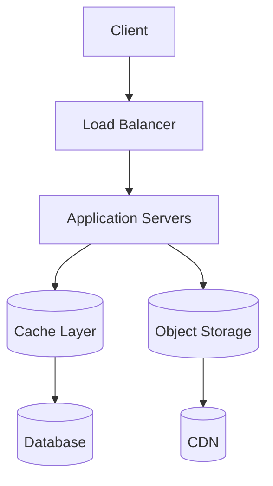
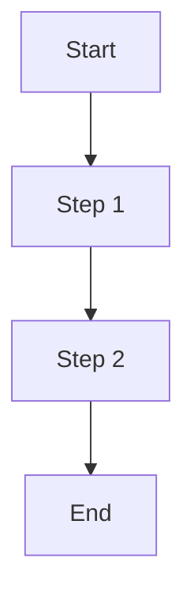

# {{TITLE}}

## Summary
Brief overview of the system design problem and key architectural decisions.

## Problem Statement
What problem does this system solve? Who are the users? What are the key requirements?

## Scale & Constraints
- **Users:** Expected number of users, daily/monthly active users
- **Traffic:** Read/write ratios, peak traffic patterns
- **Data:** Storage requirements, growth patterns
- **Performance:** Latency requirements, availability targets

## High-Level Architecture


## Detailed Design

### Core Components
- **Component Name:** Purpose and key features
- **Component Name:** Purpose and key features

### Data Models

| Entity | Key Fields | Relationships | Purpose |
|--------|------------|---------------|---------|
| **Entity** | field1, field2 | 1:N with Other | Description |

### API Design
**Key Endpoints:**
- `METHOD /endpoint` - Description
- `METHOD /endpoint` - Description

**Data Flow:**


## Trade-offs & Alternatives
**Decision 1:** Option A vs Option B
- **Pros of A:**
- **Cons of A:**
- **Why chosen:**

**Decision 2:** Approach X vs Approach Y

## Scaling Strategy
- **Horizontal Scaling:** How components scale out
- **Database Sharding:** Sharding key and strategy
- **Caching Strategy:** Cache layers and invalidation
- **Load Distribution:** Load balancing approach

## Failure Handling
- **Single Points of Failure:** Identified risks
- **Redundancy:** Backup strategies
- **Monitoring:** Key metrics and alerting

## Examples / snippets
**Key Algorithm:**
```python
def key_function(param):
    # Implementation
    pass
```

## Quizzes

Q: What are the key architectural decisions for {{TITLE}}?
Options:
- A) {{DECISION_A}}
- B) {{DECISION_B}}
- C) {{DECISION_C}}
- D) {{DECISION_D}}
Answers: {{ANSWER_LETTERS}}
Explanation: {{EXPLANATION_WHY_THESE_DECISIONS}}

## Learning Sources
- [System Design Primer](https://github.com/donnemartin/system-design-primer) - Comprehensive system design guide
- [Design Pattern Article](URL) - Specific patterns used in this design
- [Case Study](URL) - Real-world implementation examples
- [Architecture Blog](URL) - Detailed architecture discussions
- [Video Walkthrough](URL) - Visual explanation of the system
